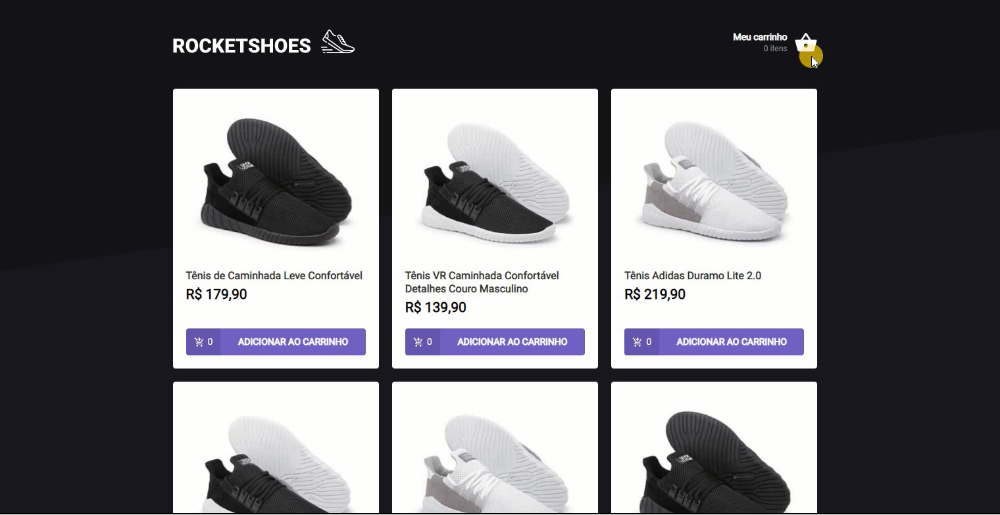

<h1 align="center">Criando um hook de carrinho de compras</h1>

<hr>

<p align="center">
  <a href="#dart-about">Sobre</a> &#xa0; | &#xa0; 
  <a href="#sparkles-features">Features</a> &#xa0; | &#xa0;
  <a href="#rocket-technologies">Tecnologias</a> &#xa0; | &#xa0;
  <a href="#white_check_mark-requirements">Requerimentos</a> &#xa0; | &#xa0;
  <a href="#checkered_flag-starting">Iniciando</a> &#xa0; | &#xa0;
  <a href="#memo-license">Licensa</a> &#xa0; | &#xa0;
  <a href="https://github.com/{{YOUR_GITHUB_USERNAME}}" target="_blank">Autor</a>
</p>

<br>

<h1 align="center">
  
</h1>

<h2 align="center">Status </h2>

<h4 align="center"> 
	🚀 Finalizado 🚀 
</h4> 

## :dart: Sobre ##

Rocketshoes é uma apliação desenvolvida como desafio na trilha React js do bootcamp Ignite da Rocketseat.

Sua Principal função é trazer a funcionalidade de um hook dentro de uma aplicação com react, selecionando o produtos e sua quantidade ou podendo excluir todos os itens da lista

## :sparkles: Features ##

:heavy_check_mark: Adicionar produto da lista;\
:heavy_check_mark: Aumentar ou diminuir a quantidade;\
:heavy_check_mark: Deletar itens na lista;

## :rocket: Tecnologias ##

As seguintes ferramentas foram utilizadas neste projeto:

- [Expo](https://expo.io/)
- [Node.js](https://nodejs.org/en/)
- [React](https://pt-br.reactjs.org/)
- [React Native](https://reactnative.dev/)
- [TypeScript](https://www.typescriptlang.org/)

## :white_check_mark: Requerimentos ##

Antes de começar :checkered_flag:, você precisa ter [Git](https://git-scm.com) e [Node](https://nodejs.org/en/) instalados.

## :checkered_flag: Iniciando ##

```bash
# Clonando o projeto
$ git clone https://github.com/{{YOUR_GITHUB_USERNAME}}/criando_um_hook_de_carrinho_de_compras

# Acessando
$ cd criando_um_hook_de_carrinho_de_compras

# Instalando dependencias
$ yarn

# Execute o projeto
$ yarn start

# O servidor iniciara no <http://localhost:3000>

# Acessando o server do projeto (API Fake)
$ Entre no Prompt de comando e coloque o caminho do arquivo
$ EXEMPLO =>  cd Desktop/Pastas/Projetos/criando_um_hook_de_carrinho_de_compras

# Execute o server no projeto projeto
$ yarn server

# O server(API Fake) estara no 
<http://localhost:3333/stock> e <http://localhost:3333/products>

```

## :memo: License ##

Este projeto está sob licença do MIT. Para obter mais detalhes, consulte o [LICENSE](LICENSE.md) file.


Feito com :heart: por <a href="https://github.com/{{YOUR_GITHUB_USERNAME}}" target="_blank">Wallace Wesley</a>

&#xa0;

<a href="#top">Voltar ao topo</a>
